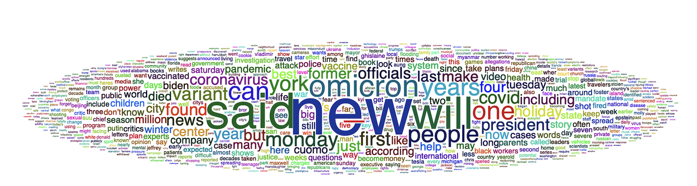
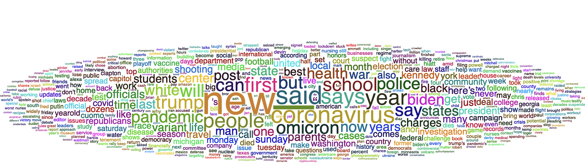

```{r setup, include=FALSE, warning=FALSE}
knitr::opts_chunk$set(echo = TRUE)
```

## 1. Preliminaries: Load Libraries and Log into Twitter

```{r, message=FALSE}
library(rtweet)
library(httpuv)
library(tidyverse)
library(tidytext)
library(wordcloud2)
library(qdapRegex)
library(tm)
library(webshot)
library(htmlwidgets)
library(ggplot2)
library(sf)
library(tmap)
library(knitr)
```

## 2. Pull Data from the Twitter API via *rtweet* Package

```{r, echo=FALSE, message=FALSE, warning=FALSE}
# Add twitter datasets to avoid calling API in markdown file
setwd("/Users/adra7980/Documents/git_repositories/twitter_workshop/exported_data")
student_debt_tweets<-read_csv("student_debt_tweets.csv")
student_debt_capitalism_tweets<-read_csv("student_debt_capitalism_tweets.csv")
student_debt_capitalism_tweets_ALT<-read_csv("student_debt_capitalism_tweets_ALT.csv")
student_debt_OR_capitalism_tweets<-read_csv("student_debt_OR_capitalism_tweets.csv")
blm_tweets<-read_csv("blm_tweets.csv")
```


```{r, eval=F}
# Pull tweets with #CancelStudentDebt; returns 1000 most recent tweets; time by GMT
student_debt_tweets<-search_tweets(q="#CancelStudentDebt", 
                                   n=1000,
                                   include_rts=FALSE,
                                   `-filter`="replies",
                                   lang="en")
```

```{r, eval=F}
# Pull tweets with #CancelStudentDebt AND capitalism
student_debt_capitalism_tweets<-search_tweets(q="#CancelStudentDebt capitalism", 
                                              n=1000,
                                              include_rts=FALSE,
                                              `-filter`="replies",
                                              lang="en")
```


```{r, eval=F}
# Pull tweets with #CancelStudentDebt OR capitalism

student_debt_OR_capitalism_tweets<-search_tweets(q="#CancelStudentDebt OR capitalism", 
                                                 n=1000,
                                                 include_rts=FALSE,
                                                 `-filter`="replies",
                                                 lang="en")
```


```{r, eval=F}
# # Pull tweets from an account (doesn't have same time constraints)
# Pull last 3200 BLM tweets (note sometimes the query will return less than 3200 due to deletions)
blm_tweets<-get_timeline("@Blklivesmatter", n=3200)
```

## 3. Clean, Organize, and Query Twitter Datasets

### 3.1. Query blm_tweets to find the 10 tweets with the most favorites

```{r}
blm_tweets_most_favorited<-blm_tweets %>% slice_max(favorite_count, n=10)

```

### 3.2. Remove unnecessary columns from "blm_tweets_most_favorited"

```{r}
blm_tweets_most_favorited<- blm_tweets_most_favorited %>% 
                              select(created_at, screen_name, text, favorite_count)
```

```{r}
blm_tweets_most_favorited
```

### 3.3 Query blm_tweets to find the 10 tweets with the most retweets and then select desired columns in one block of code

```{r}
blm_tweets_most_retweeted<-blm_tweets %>% 
                              slice_max(retweet_count, n=10) %>% 
                              select(created_at, screen_name, text, retweet_count)
blm_tweets_most_retweeted
```

### 3.4 Remove retweets from blm_tweets

```{r}
blm_tweets_noretweets<-blm_tweets %>% filter(is_retweet=="FALSE")
```

### 3.5 Query Data to find 5 most frequently shared links from blm_tweets

```{r}
blm_tweets_links_top5<-blm_tweets %>% filter(!is.na(urls_expanded_url)) %>% 
                                      count(urls_expanded_url, sort = TRUE) %>% 
                                      rename(times_shared=n) %>% 
                                      slice_max(times_shared, n=5)
                      
```

### 3.6 # Query the data to find the 5 handles that have most frequently used #CancelStudentLoan

```{r}
student_debt_tweets_frequentweeters<-student_debt_tweets %>% 
                                      count(screen_name) %>% 
                                      slice_max(n, n=5)
```

### 3.7 Query the data to find the 10 hashtags appearing most frequently in conjunction with #CancelStudentDebt
```{r, echo=FALSE}
student_debt_tweets<-search_tweets(q="#CancelStudentDebt", 
                                   n=1000,
                                   include_rts=FALSE,
                                   `-filter`="replies",
                                   lang="en")
```


```{r}
CancelStudentDebt_coinciding_hashtags<-student_debt_tweets %>% 
                                          select(hashtags) %>% 
                                          unnest(hashtags) %>%
                                          mutate(hashtag_cleaned=str_to_lower(hashtags)) %>% 
                                          filter(hashtag_cleaned!="cancelstudentdebt") %>% 
                                          select(-hashtag_cleaned) %>% 
                                          count(hashtags) %>% 
                                          slice_max(n, n=10)

```

## 4. Visualize Data

### 4.1 Using ggplot to make visualizations of twitter data: bar graph of coincident hashtags


```{r}
CancelStudentDebt_coinciding_hashtags<-CancelStudentDebt_coinciding_hashtags %>% 
                                        mutate(hashtag=paste0("#", hashtags))

coincident_hashtags_plot<-
  ggplot(CancelStudentDebt_coinciding_hashtags, aes(x=reorder(hashtag, n), y=n))+
    geom_bar(stat="identity")+
      coord_flip()+
      xlab("")+
      ylab("Frequency")+
      ggtitle("Hashtags Most Frequently Used Along With #CancelStudentDebt")+
      labs(caption = "Data Collected from Twitter REST API via rtweet")
```

```{r}
coincident_hashtags_plot
```

### 4.2. Using rtweet's visualization functions: time series example

```{r}
ts_plot(student_debt_tweets, "hours") +
  labs(x = NULL, y = NULL,
       title = "Frequency of tweets with a #CancelStudentDebt hashtag",
       subtitle = paste0(format(min(student_debt_tweets$created_at), "%d %B %Y"), 
                         " to ",  
                         format(max(student_debt_tweets$created_at),"%d %B %Y")),
       caption = "Data collected from Twitter's REST API via rtweet") +
  theme_minimal()
```

### 4.3 Mapping Tweets
```{r}
# Extract lat/longs
student_debt_tweets<-student_debt_tweets %>% lat_lng()

# remove records without geotags
student_debt_tweets_latlong_extract<-student_debt_tweets %>% 
                                      filter(is.na(lat) == FALSE & is.na(lng) == FALSE)

# create sf object from tweet dataset
student_debt_tweets_latlong_extract<-student_debt_tweets_latlong_extract %>% 
                                      st_as_sf(coords=c("lng", "lat")) %>% 
                                      st_set_crs("EPSG:4326")

# set tmap to view mode
tmap_mode("view")

# make map
tm_shape(student_debt_tweets_latlong_extract)+
  tm_dots()
```

### 4.4. Make a Word Cloud of a Twitter Handle

First, prepare a word frequency table: 

```{r, fig.asp=0.5}
blm_text<-str_c(blm_tweets$text, collapse="")


blm_text <- 
  blm_text %>%
  str_remove("\\n") %>%                   # remove linebreaks
  rm_twitter_url() %>%                    # Remove URLS
  rm_url() %>%
  str_remove_all("#\\S+") %>%             # Remove any hashtags
  str_remove_all("@\\S+") %>%             # Remove any @ mentions
  removeWords(stopwords("english")) %>%   # Remove common words (a, the, it etc.)
  removeNumbers() %>%
  stripWhitespace() %>%
  removeWords(c("amp", "the")) %>% 
  removePunctuation() %>% 
  str_remove_all(pattern='[Tt]he') %>% 
  str_remove_all(pattern='[:emoji:]')

textCorpus <- 
  Corpus(VectorSource(blm_text)) %>%
  TermDocumentMatrix() %>%
  as.matrix()

textCorpus <- sort(rowSums(textCorpus), decreasing=TRUE)
textCorpus <- data.frame(word = names(textCorpus), freq=textCorpus, row.names = NULL)
View(textCorpus)

```

```{r, echo=FALSE}
kable(head(textCorpus), n=5)
```

Make a word cloud using the word frequency table
```{r, fig.asp=0.5}
wordcloud_blm <- wordcloud2(data = textCorpus, minRotation = 0, maxRotation = 0, ellipticity = 0.2)
wordcloud_blm
```

You can write out your word cloud to disk with the following:

```{r, eval=FALSE}
install_phantomjs()
saveWidget(wordcloud_blm, "blm.html", selfcontained = F)
webshot("blm.html", "blm.png", vwidth=1000, vheight=1000, delay=10)
```

## 5. Writing Functions and Automating Your Twitter Analysis

Let's say you expect to build a lot of word clouds, and don't want to keep copy pasting your code. At that point, it makes sense to write a function that'll automatically create a word cloud, based on the inputs (twitter handle, number of tweets to pull from the API, upto 3200) that you supply.

### 5a. Wrap the code to create a word cloud into a function 

```{r}
twitter_wordcloud<-function(twitterhandle, tweet_number){
  tweet_timeline<-get_timeline(twitterhandle, n=tweet_number)
  tweet_timeline_text<-str_c(tweet_timeline$text, collapse="")

    tweet_timeline_text<-tweet_timeline_text %>%
    str_remove("\\n") %>%                   # remove linebreaks
    rm_twitter_url() %>%                    # Remove URLS
    rm_url() %>%
    str_remove_all("#\\S+") %>%             # Remove any hashtags
    str_remove_all("@\\S+") %>%             # Remove any @ mentions
    removeWords(stopwords("english")) %>%   # Remove common words (a, the, it etc.)
    removeNumbers() %>%
    stripWhitespace() %>%
    removeWords(c("amp")) %>% 
    removePunctuation() %>% 
    str_remove_all(pattern='[Tt]he') %>% 
    str_remove_all(pattern='[:emoji:]')
    
  
  textCorpus <- 
    Corpus(VectorSource(tweet_timeline_text)) %>%
    TermDocumentMatrix() %>%
    as.matrix()
  
  textCorpus <- sort(rowSums(textCorpus), decreasing=TRUE)
  textCorpus <- data.frame(word = names(textCorpus), freq=textCorpus, row.names = NULL)

  wordcloud <- wordcloud2(data = textCorpus, minRotation = 0, maxRotation = 0, ellipticity = 0.2)
  return(wordcloud)
  
}


```

### 5b. Test the function 

```{r}
# Generate word cloud for past 400 NYT twitter posts, assign to object, and view word cloud
nyt_wordcloud<-twitter_wordcloud("nytimes", 400)
```

```{r, eval=FALSE}
# View NYT wordcloud 
nyt_wordcloud
```

```{r, echo=F}
setwd("~/Documents/git_repositories/twitter_workshop")

```

### 5c. Iteratively Apply the Function to Multiple Twitter Handles

Apply the "twitter_wordcloud" function created above to multiple handles, and generate multiple word clouds based on those handles. We'll apply the function to the Twitter handles of the New York Times, Financial Times, Washington Post, Fox News, CNN, and the Denver Post. 

```{r}
handles<-c("nytimes", "FinancialTimes", "FoxNews", "cnn", "washingtonpost", "denverpost")
number<-c(400)
wordcloud_list<-map2(.x=handles, .y=number, twitter_wordcloud)
```

View the Washington Post word cloud by accessing it from the list:

```{r, eval=FALSE}
# View Washington Post Word Cloud
wordcloud_list[["washingtonpost"]]
```

```{r, echo=FALSE, message=FALSE, warning=FALSE, fig.asp=0.5}
setwd("~/Documents/git_repositories/twitter_workshop")

```

View the Denver Post word cloud by accessing from the list: 

```{r, eval=FALSE}
# View Denver Post word cloud by extracting it from the list
wordcloud_list[["denverpost"]]
```

```{r, echo=F, fig.asp=0.5}
setwd("~/Documents/git_repositories/twitter_workshop")

```

What would you type if you want to extract the Financial Times word cloud from the list? 

### 5d. Iteratively Write Out All of the Media Word Clouds to Disk

```{r, message=F, eval=F}
# Write function that takes list of word clouds, and word cloud names, and writes WC out to tisk
output_wordclouds<-function(wordclouds_to_export, wordcloud_names){
  setwd("/Users/adra7980/Documents/git_repositories/twitter_workshop/wordclouds")
  install_phantomjs()
  saveWidget(wordclouds_to_export, paste0(wordcloud_names, ".html"), selfcontained=F)
  webshot(paste0(wordcloud_names, ".html"), paste0(wordcloud_names, ".png"), vwidth=1992, vheight=1744, delay=10)
}
```

```{r, message=F, eval=F}
# iteratively apply previous function across word clouds in list and write all to disk
map2(.x=wordcloud_list, .y=names(wordcloud_list), .f=output_wordclouds)
```


